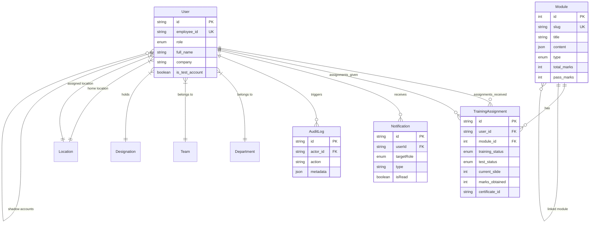

# Database Schema & Data Models Specification (`database_schema.md`)

This document provides a comprehensive specification of the relational database architecture, native PostgreSQL enums, data models, constraints, and entity relationships utilized in the **ProDriver Safety Command Center**.

---

## 1. Database Configuration & ORM Engine

- **ORM**: Prisma Client v6 (`@prisma/client`)
- **Database Engine**: PostgreSQL
- **Connection Configuration**:
  - Connection Pool URL: `env("DATABASE_URL")`
  - Direct Migration URL: `env("DIRECT_URL")`
- **Output Client Path**: `../generated/prisma-client`

---

## 2. Native PostgreSQL Enums

The application defines 5 native database enums to enforce strict type-safe state machine transitions:

### `Role`
Defines system authorization privileges.
- `BASIC`: Standard driver/operator persona with access to assigned modules and personal profile.
- `ADMIN`: Safety manager/administrator persona with access to fleet analytics, module builder, user management, and audit logs.

### `TrainingStatus`
Tracks driver engagement with safety training module slides.
- `NOT_STARTED`: Module assigned but unread.
- `ONGOING`: Module opened, slide progress tracked.
- `COMPLETED`: All training slides viewed.

### `TestStatus`
Tracks evaluation performance for safety module quizzes.
- `NOT_STARTED`: Quiz not attempted.
- `ONGOING`: Quiz currently in progress.
- `PASSED`: Minimum required pass marks achieved (`marks_obtained >= pass_marks`).
- `FAILED`: Attempted but failed to reach pass threshold.

### `LocationType`
Categorizes physical organizational sites.
- `HOME`: Driver primary residency location.
- `ASSIGNED`: Operational depot or assigned vehicle station.

### `ModuleType`
Categorizes educational assets.
- `TRAINING`: Informational safety training slide deck.
- `TEST`: Evaluative quiz/exam module.

---

## 3. Entity-Relationship Diagram (ERD)

---

## 4. Model Definitions & Specifications

### 4.1 `User` Model (`@@map("users")`)
Stores core user identity, credentials, organizational assignments, and shadow account linkages.

| Field Name | Type | Attributes / Constraints | Description |
| :--- | :--- | :--- | :--- |
| `id` | `String` | `@id @default(cuid())` | Unique user identifier. |
| `employee_id` | `String` | `@unique` | Company Employee ID (login identifier). |
| `password_hash` | `String?` | Optional | `bcryptjs` salted password hash. |
| `role` | `Role` | `@default(BASIC)` | Authorization level (`BASIC` or `ADMIN`). |
| `full_name` | `String` | Required | Full display name. |
| `company` | `String?` | Optional | Company name (e.g. `Mowasalat`, `Karwa`, etc.). |
| `email` | `String?` | Optional | User email address. |
| `mobile_number` | `String?` | Optional | Contact phone number. |
| `preferred_language`| `String` | `@default("en")` | UI language preference code. |
| `is_test_account` | `Boolean` | `@default(false)` | Flag indicating admin shadow/test user account. |
| `linked_parent_id` | `String?` | `@relation("AdminShadow")` | Foreign key linking shadow account to parent admin ID. |
| `department_id` | `String?` | `@relation(fields)` | Foreign key to `Department`. |
| `team_id` | `String?` | `@relation(fields)` | Foreign key to `Team`. |
| `designation_id` | `String?` | `@relation(fields)` | Foreign key to `Designation`. |
| `home_location_id` | `String?` | `@relation("HomeLoc")` | Foreign key to `Location` (Home). |
| `assigned_location_id`| `String?`| `@relation("AssignedLoc")`| Foreign key to `Location` (Assigned depot). |
| `createdAt` | `DateTime` | `@default(now())` | Account creation timestamp. |
| `updatedAt` | `DateTime` | `@updatedAt` | Account modification timestamp. |

---

### 4.2 `Module` Model (`@@map("modules")`)
Represents safety training presentations and evaluation tests.

| Field Name | Type | Attributes / Constraints | Description |
| :--- | :--- | :--- | :--- |
| `id` | `Int` | `@id @default(autoincrement())` | Primary key integer ID. |
| `title` | `String` | Required | Title of training/test module. |
| `slug` | `String` | `@unique` | URL-friendly unique slug. |
| `content` | `Json?` | Optional | Structured JSON storing slide content, media URLs, and quiz questions. |
| `is_published` | `Boolean` | `@default(false)` | Publication visibility flag. |
| `description` | `String?` | Optional | Summary description. |
| `file_source` | `String` | Required | Path to source material or Cloud storage object key. |
| `thumbnail_url` | `String?` | Optional | Cover image thumbnail URL. |
| `total_marks` | `Int` | `@default(0)` | Maximum achievable quiz score. |
| `pass_marks` | `Int` | `@default(0)` | Score threshold required to pass. |
| `duration_minutes` | `Int` | `@default(0)` | Estimated module completion time. |
| `is_active` | `Boolean` | `@default(true)` | Operational active status flag. |
| `type` | `ModuleType` | `@default(TRAINING)` | Module classification (`TRAINING` or `TEST`). |
| `linked_module_id` | `Int?` | `@relation("ModuleLinks")` | Optional ID linking a training module directly to a test module. |
| `createdAt` | `DateTime` | `@default(now())` | Creation timestamp. |
| `updatedAt` | `DateTime` | `@updatedAt` | Update timestamp. |

---

### 4.3 `TrainingAssignment` Model (`@@map("training_assignments")`)
Join model connecting drivers (`User`) with safety `Module` instances to record slide progression and test grades.

| Field Name | Type | Attributes / Constraints | Description |
| :--- | :--- | :--- | :--- |
| `id` | `String` | `@id @default(cuid())` | Assignment CUID identifier. |
| `user_id` | `String` | `FK -> User.id (onDelete: Cascade)` | Assigned driver ID. |
| `module_id` | `Int` | `FK -> Module.id (onDelete: Cascade)` | Assigned module ID. |
| `assigned_by_id` | `String?` | `FK -> User.id` | Admin user ID who created assignment. |
| `assigned_date` | `DateTime` | `@default(now())` | Date of assignment. |
| `due_date` | `DateTime?`| Optional | Expiration / due deadline date. |
| `training_status` | `TrainingStatus` | `@default(NOT_STARTED)` | Slide progress state machine (`NOT_STARTED`, `ONGOING`, `COMPLETED`). |
| `test_status` | `TestStatus` | `@default(NOT_STARTED)` | Quiz performance state machine (`NOT_STARTED`, `ONGOING`, `PASSED`, `FAILED`). |
| `current_slide` | `Int` | `@default(1)` | Last viewed slide index number. |
| `marks_obtained` | `Int` | `@default(0)` | Test score achieved by user. |
| `completion_date` | `DateTime?`| Optional | Timestamp when module was passed. |
| `certificate_id` | `String?` | Optional | Unique digital certificate verification code. |
| `updatedAt` | `DateTime` | `@updatedAt` | Record update timestamp. |

- **Composite Unique Constraint**: `@@unique([user_id, module_id])` prevents duplicate assignments of the same module to a single driver.

---

### 4.4 Master Data Models

#### `Team` (`@@map("teams")`)
- `id` (`String`, `@id @default(cuid())`)
- `name` (`String`, `@unique`)
- `createdAt` (`DateTime`, `@default(now())`)

#### `Department` (`@@map("departments")`)
- `id` (`String`, `@id @default(cuid())`)
- `name` (`String`, `@unique`)
- `createdAt` (`DateTime`, `@default(now())`)

#### `Designation` (`@@map("designations")`)
- `id` (`String`, `@id @default(cuid())`)
- `name` (`String`, `@unique`)
- `createdAt` (`DateTime`, `@default(now())`)

#### `Location` (`@@map("locations")`)
- `id` (`String`, `@id @default(cuid())`)
- `name` (`String`)
- `type` (`LocationType`: `HOME` | `ASSIGNED`)
- `createdAt` (`DateTime`, `@default(now())`)

---

### 4.5 System Logging & Alerts

#### `AuditLog` (`@@map("audit_logs")`)
Records administrative actions for compliance auditing.
- `id` (`String`, `@id @default(cuid())`)
- `action` (`String`): Action identifier (e.g. `USER_CREATED`, `MODULE_PUBLISHED`, `ROLE_CHANGED`).
- `actor_id` (`String`, `FK -> User.id`): ID of admin who performed action.
- `target_id` (`String?`): Target entity ID affected.
- `metadata` (`Json?`): Context payload (IP address, changed fields, diff payload).
- `timestamp` (`DateTime`, `@default(now())`)

#### `Notification` (`@@map("notifications")`)
Pushes operational and critical alerts to users and role groups.
- `id` (`String`, `@id @default(cuid())`)
- `type` (`String`): Notification category (`CRITICAL`, `OPERATIONAL`, `INFO`).
- `title` (`String`)
- `message` (`String`)
- `isRead` (`Boolean`, `@default(false)`)
- `userId` (`String?`, `FK -> User.id`): Targeted individual user ID.
- `targetRole` (`Role?`): Targeted role group (`ADMIN` or `BASIC`).
- `link` (`String?`): Optional deep-link URL.
- `metadata` (`Json?`)
- `createdAt` (`DateTime`, `@default(now())`)
